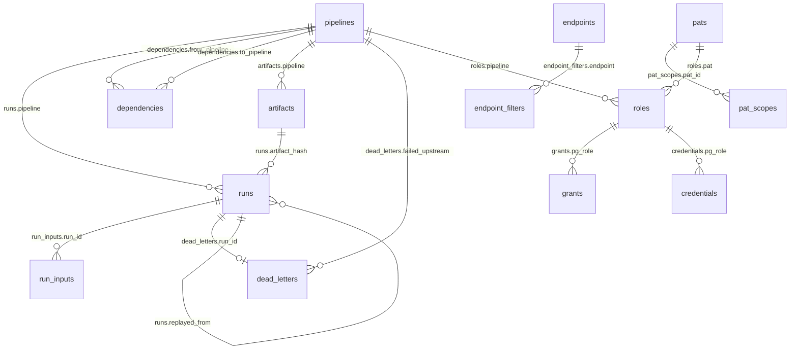

## **Model scope**

**Iris:** provenance-first data engine, git blame for every database row. Every write attributed in-transaction to its exact run, binary, and declaration; ==`iris data provenance`== answers any row's origin, forever.
**Pipeline orchestrator:** Docker Compose for routines; any-language scripts.

Core tenets:
- **Pipeline** = folder + declaration + one script, direct-exec (no shell) as an engine-owned subprocess.
- **Modes**: two artifact modes (dev source / built binary) × two data modes (disposable / permanent); permanent requires built; binaries are content-addressed.
- **Tables**: declared in `schemas/`, declarative-diff, additive-only; `reads`/`writes` are access control, never ordering; any number of pipelines may write one table, safe per row.
- **Database access**: engine-owned least-privilege Postgres roles with injected connections; authors never handle credentials.
- **Meta and data**: one Postgres cluster, two databases: `meta` (control state, leader-written) and the data database (`data` in managed mode) holding declared tables + journal; no SQLite.
- **Write capture**: core, always on, no opt-out; triggers journal every write into `public.data_journal` in the same transaction; one journal, two consumers: undo and provenance.
- **Provenance stack**: every run snapshot-pinned; the journal partitioned, sealed, archived.
- **Read endpoints**: declared data products at `GET /q/{endpoint}`: shape, never authority.
- **Orchestration**: `depends_on` gates eligibility and propagates failure; the composer's `order` is the sole sequence; perpetual lane loops, no clock, no triggers.
- **Concurrency**: lanes (serial within, parallel across, no engine cap); execution local to the leader's host.
- **Execution policy**: no params, retries, backoff, or time ceiling; a run ends by exiting or by `iris run cancel`; failures park in the dead-letter worklist, replayed on demand.
- **States**: queued, running, succeeded, dead-lettered, the single non-success terminal state.
- **Daemon**: foreground by default, any number of candidates, exactly one leader (advisory lock); liveness is connection state; pipelines run only while a leader is up.

**Naming**: `iris-declare.yaml`, noun "declaration"; `meta` (control-plane database); "the data database" (warehouse; managed-mode name `data`; reserved `public` schema: engine-readable surface holding `public.data_journal`); "capture" (mechanism: triggers + journal, never a place); "dead-letter worklist" (`dead_letters`; command noun `iris deadletter`, alias `iris dl`); "leader"/"standby" (daemon roles); "stamp" (slim provenance-only journal entry); `snapshot_lsn`/`journal_floor`/`journal_ceiling` (run's pin); "seal" (compact + checkpoint full journal partition); `journal_checkpoints` (signed checkpoint chain); "engine key" (signs checkpoints); "object store" (`objects_path`: content-addressed artifact bytes + archived partitions); ==`iris data provenance` (the row readout: authorship plus lineage); "wiring" (the standing graph: `depends_on` gates plus composer order, what may run) vs "lineage" (the run DAG: `run_inputs`, what did run), two graphs that never share a rendering; `iris workload` (the wiring's noun: `show` and `wipe`, each taking an optional pipeline)==.

## 1. Domain & Execution Model

**Q - What is a pipeline?** A: Folder named for the pipeline: `iris-declare.yaml` plus one script, any language. Pipeline = script: one indivisible unit, no internal stages. Relational: `depends_on` wires to other pipelines, lane composer orders within a lane; a node, never a graph itself.

**Q - Execution?** A: Direct exec, never a shell (no pipes/globs in `run`): engine-owned subprocess on the leader's host, own process group. Working dir = pipeline folder; env = inherited + declared env + injected scoped DB connection. Engine owns run, captures output, cancels/kills reliably; handle = process-group id (`runs.handle`).

**Q - Modes (dev vs built)?** A: Dev: source via language runtime (e.g. `python main.py`), fast iteration. Built: self-contained binary of the same script: fast cold start, no host runtime, content-addressed (executed bytes always identifiable). Both direct-exec, fully wired (injected connection, orchestration).

**Q - Build and promote?** A: (1) `iris pipeline build`: compiles source to one self-contained binary, records content hash (toolchain inferred from `run`). (2) `iris pipeline promote`: marks data permanent, only once built. Promotion ends wipe eligibility only; capture and provenance never stop. Build never folds into apply.

**Q - Disposable vs permanent data?** A: Artifact (source/built) and data (disposable/permanent) toggle independently; permanent requires built. Valid: source+disposable (dev), built+disposable (throwaway-data artifact test), built+permanent (production). Blocked: source+permanent; loose source never writes permanent data. Capture covers all modes; only payload differs.

**Q - Run states?** A: queued, running, succeeded, dead-lettered. Dead-lettered: single non-success terminal state (failed, stopped/cancelled, or upstream_dead_lettered), parked in dead-letter worklist.

**Q - Dependency vs sequence; failure?** A: `depends_on`: B needs A's output (eligibility + failure propagation, no order). Composer `order`: B runs after A without needing its data (order only). Failure isolated, never globally fatal; nothing auto-retries.

**Q - Runtime parameters?** A: No. `--param` and params-files removed; yaml fully determines a run.

**Q - Timeout/cancellation?** A: None: engine never kills a run unilaterally. Runs end by exiting or via `iris run cancel <run>`: kills the process group, dead-letters it (stopped), touches nothing else. Hung run holds its lane until cancelled (accepted cost): signal = stalled lane, remedy = one deliberate command, never an engine clock.

## 2. Process Architecture & Control Plane

**Q - Daemon run mode?** A: Foreground default (attached, streaming); `-d` detaches. No boot autostart. Candidates unlimited; exactly one leader, sole dispatcher. On demand, never auto-shipped: `iris engine service install` installs a systemd/launchd unit wrapping the detached daemon, itself service-ready (clean SIGTERM/SIGINT, no TTY, sane exit codes).

**Q - CLI-daemon communication?** A: Default: unix socket, always-on, local-only, filesystem permissions, zero-config, HTTP/JSON. Opt-in TCP: remote control, PAT-gated (authenticates, not encrypts); untrusted networks: TLS recommended, not mandated (`--tcp`, `--tls-cert`/`--tls-key`, or `iris.toml`; no certs: plain TCP). CLI never opens `meta`; every state change via leader (single-writer). Daemon-touching commands fail fast with start guidance, never auto-start; standbys reject mutations with leader guidance. Daemonless exceptions: `iris engine install`, `start`, `service install`/`uninstall`, `uninstall` on a stopped daemon, and `update` (self-replace of the installed binary, no daemon).

**Q - Meta-state concurrency?** A: Single writer: only leader writes `meta` (advisory lock guarantees one leader), serialized via one dispatcher-owned path. Readers: plain Postgres connections, MVCC. No busy-retry anywhere.

**Q - Admin credential?** A: One daemon-owned admin DSN, startup-resolved: `--pg-dsn` > `IRIS_PG_DSN` > `pg_dsn` (`iris.toml`) > no default, fail fast. Needs CREATEROLE, CREATEDB, managed-schema ownership; not superuser. Never in `meta`: memory-held, startup-validated; all Postgres connections derive from it. CLI never sees it; daemonless lifecycle commands resolve same chain, never store it.

**Q - Engine state location?** A: `meta`: dedicated database, same cluster as data, 17 control tables in `public`; never a warehouse schema; invisible to pipeline roles and data PATs. One cluster, one DSN: `--pg-dsn` covers both. No SQLite, no `.iris/state.db`. Capture exception: journal at `public.data_journal` in the data database (triggers write in the data's transaction).

**Q - Managed vs external Postgres?** A: Two modes, one code path. Default engine-managed: `iris engine install` downloads pinned, checksummed Postgres into `.iris/pg/` (no Docker, no host package); a daemon-managed subprocess: started before any lane, stopped on shutdown, local socket default, engine-minted superuser CLI never sees; hosts `data` and `meta`, TCP when standbys need it. External: any `pg_dsn`: user-provided Postgres, no local instance, internally identical (same admin-DSN path). Major version pinned per engine release; data directory records version; mismatch fails fast, never silent auto-upgrade.

**Q - Crash recovery?** A: Leader runs startup reconciliation before any lane; cold start and failover identical. Queued never-started runs: deleted, not dead-lettered (consumed nothing; next pass recreates). Leftover running runs: dead-lettered (stopped, "daemon terminated while run was in flight"). Process groups and recorded handles: same-host restart best-effort SIGKILLs survivors first; cross-host failover leader dead-letters without killing (deposed leader's self-demotion kills them). No journal step: capture rows sit where triggers wrote them; crashed disposable-run partials stay revertible. Nothing auto-replays.

**Q - Logging and lifecycle plumbing?** A: Structured JSON logs (`slog`); human console in foreground. Size-based rotation only, never time-based: daemon log 10 MB, 5 generations; per-run logs unrotated (bounded output), run-id-keyed under `.iris/logs/` (`runs.log_ref`), deleted when run row pruned. SIGTERM/SIGINT: graceful shutdown, stop dispatching, finish or cleanly kill in-flight runs, flush state.

## 3. iris-declare.yaml + Schema File

**Q - Scope?** A: Per-pipeline only; no project-wide manifest. `iris declare apply`/`iris declare destroy` each target exactly one declaration file, never the workspace or a set.

**Q - What fields?** A: Eight: `name`, `run`, `env`, `env_file`, `lane`, `reads`, `writes`, `depends_on`. Absent: `language`, `build`, `param`, `retry`, `schedule`, `triggers`, `executor`, `deadline`, `timeout`, `state` (state is data: cursor in a declared `writes` table, journaled, revertible). Engine infers/owns the rest; clocks never initiate work; no reactive event family; run placement engine-owned, never declared.

**Q - Versioned?** A: Hashed, not versioned. Every run records declaration hash (`runs.declaration_checksum`), binary hash, consumed upstream run ids: provenance names exact declaration and artifact even after pruning (archival summary).

**Q - `name`?** A: String, required. Referenced by `depends_on` and composer `order`. Must match folder name; validated on apply.

**Q - `run`?** A: String list, required. Dev-mode direct-exec argv, e.g. `[python, main.py]`: plain vector, no shell. Engine infers build toolchain from it; built mode ignores it, runs binary directly.

**Q - `env`, `env_file`?** A: Both optional, both for secrets: resolved at run time, never stored in `meta`. `env`: Compose-style map, literals (`KEY: value`) or daemon-env interpolations (`KEY: ${HOST_VAR}`), merged onto inherited environment. `env_file`: external `KEY=VALUE` file(s), read fresh each run, explicit `env` wins. Leader resolves at dispatch; workspace tree: per-host prerequisite of every daemon candidate.

**Q - `lane`?** A: String, optional; omitted = own lane, parallel with everything. Same-lane: serial in composed order; separate lanes: parallel. Join inline (`lane: <name>`) or by containment; if both, must agree. `depends_on` may cross lanes (gate, not order).

**Q - Lane composer?** A: A lane-folder `iris-declare.yaml`, one level above the pipeline folders it sequences (same filename; pipeline has `run`, composer has `order`). Carries `lane: <name>` (matching its folder) plus `order`, the lane's serial walk. Required at 2+ pipelines (2+ lane without composer rejected); single-pipeline lane needs none. Membership by containment: each `order` name a pipeline folder inside the lane folder; each pipeline in exactly one lane; both validated on apply. Inline `lane:` without containment valid only while single-member; apply creating a 2+ lane with a member outside the folder rejected, guidance: move it in. Persists to `lanes` as name-keyed rows, written whole only by the composer's own apply; single-member lane: no composer, no `lanes` row, name nominal until composer promotes to 2+.

**Lane composer YAML (`ingest/iris-declare.yaml`):**
```yaml
lane: ingest
order:
  - extract_orders
  - reset_counters
  - load_orders
```

**Q - `reads`, `writes`?** A: Lists, optional. Access at schema + table + field granularity: each entry names `table` (dotted `schema.table`) plus `fields`, both required; no implicit all-columns, omission rejected. Apply records them in `meta`, grants exactly them on the pipeline's Postgres role. Access only, never run order. Neither exclusive; concurrent-writer safety: engine's problem, not a declaration constraint.

**Q - `depends_on`?** A: Name list, optional, the only relational field. Both mechanisms persist as rows in separate tables (`dependencies`, `lanes`). Graph acyclic: apply rejects cycles (including self-reference), names the chain. References must be already registered (apply single-file, upstream-first): unregistered reference rejected, never deferred.

**Representative YAML declaration:**
```yaml
name: load_orders
run: [python, main.py]
lane: ingest                               # joins the ingest lane; order lives in the composer
env:
  LOG_LEVEL: info            # literal
  REGION: ${REGION}          # interpolated from the daemon environment at run time
env_file: ./secrets.env      # loaded at run time, never stored
reads:
  - table: raw.orders_staging
    fields: [id, customer_id, amount, created_at]
writes:
  - table: analytics.orders
    fields: [id, customer_id, amount, created_at]   # fields are required
depends_on: [extract_orders]               # data gate (eligibility + propagation)
```

**Q - Table declarations?** A: One `schemas/` directory per workspace: folder per schema, per table; table folder holds `table.yaml` (desired state) plus engine-written `migrations/` ledger. Folder names authoritative; `schema:`/`table:` validated against them. Declarative-diff: `table.yaml` = desired head; engine diffs, writes the ledger. `public` engine-reserved: apply rejects a `public` schema folder and any `reads`/`writes` on `public.*`.

```
schemas/
  analytics/                  # schema folder
    orders/                   # table folder
      table.yaml              # desired state (source of truth)
      migrations/
        0001_create.yaml      # engine-written, immutable
        0002_add_status.yaml
    customers/
      table.yaml
      migrations/
        0001_create.yaml
  raw/
    orders_staging/
      table.yaml
```

**Q - Beyond `table.yaml`?** A: One engine addition: capture triggers, installed at provisioning on every declared table. Always on, never declared or opted out, no columns added (engine-added column = non-additive drift); `table.yaml` stays authoritative for shape.

## 4. Engine-State Schema (meta and the data journal)

**Q - Where do engine tables live?** A: Both Postgres, one cluster: control state in `meta`; capture state at `public.data_journal` in the data database (triggers write in the data's transaction). Journal `run_id` → `runs`: logical, never FK-enforced.

**Q - Which tables exist?** A: Twenty-one: twenty in `meta` (including `engine_key`, the engine's ed25519 signing key; `read_pool_credential`, the shared read-pool login secret; and `leadership`, the leader's advertised address), one (`data_journal`) in the data `public` schema. Ordering: monotonic bigint identity, never a clock; `recorded_at`: opaque audit string, log correlation only.

**Roster (meta):**
- `pipelines`
- `dependencies`
- `lanes`
- `runs`
- `run_inputs`
- `dead_letters`
- `artifacts`
- `run_summaries`
- `journal_checkpoints`
- `engine_key`
- `read_pool_credential`
- `leadership`
- `pats`
- `pat_scopes`
- `endpoints`
- `endpoint_filters`
- `roles`
- `grants`
- `credentials`
- `migrations`
**Roster (data database):**
- `public`.`data_journal`

**Q - `pipelines`?** A: Registry root. `name` PK, `folder`, `run` (JSON argv), `artifact` in (source, built), `data_mode` in (disposable, permanent).

**Q - `dependencies`?** A: `depends_on` graph as edge rows. `from_pipeline` FK, `to_pipeline` FK, PK (both), indexed both directions; "from depends_on to", from = dependent. Read by gate, propagation, lineage. May cross lanes.

**Q - `lanes`?** A: Persisted composer: one row per name-in-a-lane. `lane`, `pipeline` (name, never FK: an `order` may name unregistered folders), `pos`; PK (`lane`, `pipeline`), `UNIQUE (pipeline)`, `UNIQUE (lane, pos)`. Written only by composer apply as an atomic full-lane rewrite; pipeline applies never touch it. Runner walks `WHERE lane = ? ORDER BY pos`, skipping unregistered names. Absent pipeline: its own anonymous lane.

**Q - `runs`?** A: History root. `id` bigint identity PK, `pipeline` FK, `state` in (queued, running, succeeded, dead_lettered), `cause` in (manual, loop, replay, propagated), `replayed_from` (nullable self-FK: replaced dead-lettered run; replay lineage here), `exit_code`, `handle` (subprocess process-group id, crash-recovery key), `artifact_hash` FK→artifacts (null for dev runs), `declaration_checksum`, `log_ref` (run log), `snapshot_lsn` (data-database LSN at dispatch), `journal_floor` / `journal_ceiling` (journal high id at dispatch / terminal transition: run's journal window), `recorded_at`. Index (pipeline, id).

```
id=42  pipeline=load_orders  state=succeeded  cause=loop  exit_code=0
handle=8123  artifact_hash=NULL  declaration_checksum=<sha256 ...>
log_ref=.iris/logs/run-42.log  snapshot_lsn=0/16A3D2F0  journal_floor=81  journal_ceiling=95
```

**Q - `run_inputs`?** A: Consumption ledger: one row per consumed upstream run (fan-in = several rows). `run_id` FK; `upstream_run_id` **not** FK (logical-only, the precedent is `data_journal.run_id`): count-based retention (§6.2, no reference pin) prunes an upstream run while a cross-pipeline downstream's ledger row survives, so `upstream_run_id` resolves to a live run **or its archival summary**, never a hard FK — a FK there would either block the prune (RESTRICT, a live violation) or cascade-delete a surviving run's consumption record (erasing lineage and re-opening its gate), and the composite PK forbids SET NULL. PK (both). Written once at run start, never mutated. ==Also indexed on `upstream_run_id`: the downstream walk (`iris run show --trace --down`, the dead-letter blast radius) is a reverse lookup the primary key cannot serve.== Lineage and the gate's already-consumed check (upstream's latest success consumed?) query it; no mutable cursor.

**Q - `dead_letters`?** A: Worklist: parking lot, not a queue, not history. One row per outstanding dead-lettered run awaiting disposition. `run_id` PK FK, `reason` in (failed, stopped, upstream_dead_lettered), `error`, `failed_upstream` (immediate upstream whose dead-lettered run propagated; else null). Exit paths: replay (replacement run minted), supersession, drain. Run row stays in `runs`; `run_summaries` outlives pruning. Depth = row count.

**Q - `artifacts`?** A: Content-addressed built binaries. `hash` PK, `pipeline` FK, `size_bytes`, `recorded_at`. Bytes live in the object store under the hash: row = index, never payload (no blobs in Postgres; failover byte access: store's per-host rule). Rows immutable: rebuild inserts a new hash; current artifact = pipeline's newest row. Retirement bounds growth: post-prune the dispatcher deletes rows neither pipeline-newest nor referenced by a surviving run, plus objects; `run_summaries` copies the hash sans FK (pruned runs still name it).

**Q - `run_summaries`?** A: Archival tier: core, so lineage never dangles. Pre-prune, the pruner writes one summary: `run_id` PK, `pipeline` (copied, not FK), `state`, `artifact_hash`, `declaration_checksum`, `consumed_upstream_run_ids` (JSON), `snapshot_lsn` / `journal_floor` / `journal_ceiling` (the pin: input state survives pruning), `recorded_at`. Insert-only, never pruned, no FKs by design: outlives all it summarizes.

**Q - `journal_checkpoints`?** A: Tamper-evidence chain over the sealed journal, insert-only, never pruned. One row per sealed partition: `seq` bigint identity PK, `id_from`/`id_to`, `digest` (hash over compacted rows in id order), `parent_digest` (chains to prior checkpoint: tampering or loss breaks visibly), `signature` (engine-key signed digest, ed25519), `location` in (resident, archived), `recorded_at`. In `meta`; partitions referenced logically.

**Q - `engine_key`?** A: The engine's ed25519 signing key, whose signature seals the checkpoint chain (§14). Single row, `id` pinned to 1: `private_key` (the raw ed25519 private half), `created_at`. Minted once at install (INSERT ... ON CONFLICT DO NOTHING, so two candidates converge on one key) and read back by the leader's seal to sign each checkpoint; the public half is surfaced by `iris engine info`. In `meta`, engine-admin-only: no role grant touches it and every pipeline/data-PAT/read-pool role is denied CONNECT on `meta`, so the private half is unreachable. A `meta` table, deliberately not a per-database GUC (`ALTER DATABASE meta SET` needs SUPERUSER the external admin role lacks) and not a workspace key file (which would force a shared filesystem for HA): the shared `meta` database standbys already read gives HA superuser-free, so a restart or failover leader signs the same chain.

**Q - `read_pool_credential`?** A: The engine's shared read-pool login secret. Single row, `id` pinned to 1: `secret` (the base64url password of the shared `iris_engine_read` login the read pool connects as on every node) and `created_at`. Minted once at first daemon start (INSERT ... ON CONFLICT DO NOTHING, so two daemons on one data cluster converge on ONE secret) and read back by every node's read-pool open; a restart or HA standby reuses the stored secret and sets the shared login's password to it (an idempotent password-only ALTER by the role's creator, superuser-free on PG16+), rather than minting a fresh secret and resetting the login (last-starter-wins, which killed an earlier node's pool). In `meta`, engine-admin-only like `engine_key`: no role grant touches it and every pipeline/data-PAT/read-pool role is denied CONNECT on `meta`, so the secret is unreachable to any caller. A `meta` table for the same HA reason as `engine_key`: the shared `meta` database standbys already read gives one stable read-pool credential across restart and failover, superuser-free.

**Q - `leadership`?** A: The leader's advertised address: the string a standby names for retargeting (exit 6, `GET /leader`) and an operator passes to `--host`. Single row, `id` pinned to 1: `advertised_addr` (the leader's TCP listen address, empty when socket-only), `recorded_at`. The leader upserts it through the single writer on winning the advisory lock and re-advertises each term, so a failover leader supersedes the prior address; a deposed leader writes nothing (its dead session cannot), so the row converges on the live leader. Standbys read it (shared `meta`, the HA model) to name the leader; an empty or absent address renders as "unknown", honest since there is then no cross-host retarget target. In `meta`, engine-owned: no role grant touches it, and it is a hint for retargeting, never a second control channel.

**Q - `pats` / `pat_scopes`?** A: Unified PAT store gating remote control and the read API. `pats`: `id` PK (token prefix), `hash` (argon2id), `label`, `revoked`. `pat_scopes` (scope set, 1NF): `pat_id` FK, `scope` in (control, read, data), PK (both); effective authority = union of rows. A `data` PAT also owns an engine-managed read-only Postgres role (access ledger).

**Q - `endpoints` / `endpoint_filters`?** A: Persisted read endpoints. `endpoints`: `name` PK, `source` (dotted `schema.table`), `fields` (JSON projection), `sort` (keyset key, a unique column). `endpoint_filters`: `endpoint` FK, `param`, `op` in (eq, range), PK (`endpoint`, `param`). Endpoints own no roles or credentials; execution authority: always the calling PAT's role.

**Q - `roles` / `grants` / `credentials`?** A: Engine-owned access ledger: truth in `meta`, reconciled onto the data database. `grants`: (`pg_role`, `schema`, `table`, `field`, `access`), indexed on `pg_role`. `roles`: maps `pg_role` to owner, `pipeline` or `data` PAT (exactly one set). `credentials`: engine-managed secret per login role, pipeline roles only. Data-PAT roles: `NOLOGIN`, assumed via `SET ROLE` on the API read path (grants, no credential row).

**Q - `migrations`?** A: Durable ledger of applied table migrations from `schemas/`. (`schema`, `table`, `migration_id`) PK, `parent`, `checksum`, `applied_seq`. Records each table's applied head for ledger-versus-disk drift detection.

**Q - `data_journal` (`public`, data database)?** A: Always-on write capture: one row per write per run to declared tables. `id` bigint identity PK, `pg_role`, `run_id`, `schema`, `table`, `row_pk`, `op` in (insert, update, delete), `pre_image` (JSON prior row; only on wipe-eligible update or delete, null on inserts and entries born promoted: slim stamp, ≤128-byte budget plus two indexes, PK and (schema, table, row_pk, run_id) provenance key), `undo` in (open, promoted, wiped==, skipped==), `recorded_at`. No post-image: provenance returns lineage, never images; wipe conflict check journal-internal. Statement-level triggers with transition tables: one INSERT…SELECT per statement (10M-row load = one trigger, not 10M). Attribution: run id rides the injected connection (per-session setting at spawn), trigger-read in-transaction; no row keyed to a role without a run. Single-stage: hot write path moves nothing; partitioning, sealing, archiving downstream. Every role may SELECT, none may write (`public` = the readable surface).

```
id=88  pg_role=iris_load_orders  run_id=42  schema=analytics  table=orders  row_pk=9f3c..
op=update  undo=open      pre_image={"id":"9f3c..","amount":100}   # wipe-eligible: carries the pre-image
id=91  pg_role=iris_load_orders  run_id=57  schema=analytics  table=orders  row_pk=9f3c..
op=update  undo=promoted  pre_image=NULL                           # the common case: a slim stamp
```

**Q - Relations?** A: Two roots: `pipelines` (registry), `runs` (history). `migrations`, `run_summaries`, `journal_checkpoints`, `engine_key`, `read_pool_credential`, `leadership` stand alone. `data_journal` hangs off `runs` logically only (cross-database, no FK). `lanes` references `pipelines` by name, not FK (hence absent). `run_inputs.upstream_run_id` references `runs` logically only, no FK (hence absent from the diagram): retention prunes an upstream run while a cross-pipeline downstream's ledger row survives, so it resolves to a run or its archival summary, exactly like `data_journal.run_id`; `run_inputs.run_id` (the downstream's own run) stays a FK, cascaded before the run in the prune. FKs:



**Q - Managed and viewed?** A: Engine-internal: not user-declared, no folder. DDL embedded in the binary: create-if-missing at bootstrap, re-checked each leader election; no self-migration ledger, no version gate (`meta` = engine memory, not migration-managed). Only the leader writes. Viewing never blocked (MVCC): any Postgres client reads `meta` read-only while the daemon runs; journal readable in place. Curated views: `iris engine inspect`, `pipeline list`, `run list`, ==`workload show`,== `engine stats`, the read API.

**Q - Bootstrap?** A: `iris engine install` (admin DSN): create `meta` if missing (plain CREATE DATABASE, hence CREATEDB), ensure its tables, create the partitioned journal `public.data_journal`, mint the engine key (ed25519; public half via `iris engine info`, private half in the `meta` `engine_key` table, a create-once INSERT superuser-free), set up the socket. `iris engine uninstall`: full teardown; drops `meta` and journal (all captured provenance), deletes object store under `objects_path`, removes socket and service unit. Distinct from `iris declare destroy`: one declared unit at a time, engine and `schemas/` intact.

## 5. Postgres Schema, DDL, Drift, Migration

**Q - Who owns tables?** A: No pipeline; `schemas/` is sole truth for declared tables. Engine owns undeclared, non-user-editable, engine-ensured surfaces: journal plus triggers (`public`), and `meta`.

**Q - YAML-to-Postgres type mapping?** A: Closed set; unknown type fails apply.

| YAML type        | Postgres type      |
| ---------------- | ------------------ |
| `uuid`           | `uuid`             |
| `text`           | `text`             |
| `varchar(n)`     | `varchar(n)`       |
| `int`            | `integer`          |
| `bigint`         | `bigint`           |
| `smallint`       | `smallint`         |
| `numeric(p,s)`   | `numeric(p,s)`     |
| `numeric`        | `numeric`          |
| `double`         | `double precision` |
| `bool`           | `boolean`          |
| `timestamptz`    | `timestamptz`      |
| `timestamp`      | `timestamp`        |
| `date`           | `date`             |
| `time`           | `time`             |
| `json` / `jsonb` | `json` / `jsonb`   |
| `bytea`          | `bytea`            |

**Q - What column modifiers exist?** A: Four: `primary_key`, `nullable` (default true; implied false under primary key), `default` (raw SQL expression), `unique`. Worked example:

```yaml
# schemas/analytics/orders/table.yaml
schema: analytics
table: orders
columns:
  - name: id
    type: uuid
    primary_key: true
  - name: customer_id
    type: uuid
    nullable: false
  - name: amount
    type: numeric
  - name: created_at
    type: timestamptz
    default: now()
```

```sql
CREATE TABLE analytics.orders (
    id          uuid        PRIMARY KEY,
    customer_id uuid        NOT NULL,
    amount      numeric,
    created_at  timestamptz DEFAULT now()
);
```

**Q - Schema provisioning?** A: Pipeline-independent, idempotent, create-if-missing. Walks `schemas/`: CREATE SCHEMA IF NOT EXISTS per folder; missing table: created from `table.yaml` head, ledger head recorded as applied; existing table: pending additive migrations; exactly one path per table. Both end ensuring capture: partitioned journal once per data database, capture triggers on every declared table.

**Q - Disposable vs permanent, physically?** A: One store: the declared tables themselves; no separate schema, copy, or namespace; dev pipelines share via `depends_on` as production; no seeding or mirroring. Isolation logical: a row change disposable exactly while its journal entries remain in wipe scope. Control truth: per-pipeline `data_mode` in `meta`; `iris pipeline promote` (gated on built) flips it permanent. Cross-mode reads (resolved): apply warns, never refuses, when a permanent-data pipeline declares reads on a disposable-mode pipeline's table (legitimate mid-promotion); warning rides `--json`; `promote` repeats it while upstream stays disposable. Permanent rows from since-wiped inputs: author reconciles.

**Q - Wipe mechanics?** A: ==`iris workload wipe [<pipeline>]`== replays wipe-scope entries in reverse==, all of them or one pipeline's (the same narrowed revert `declare destroy` runs on its target),== (deletes disposable inserts, restores pre-images for updates/deletes) in one data-database transaction (journal and tables co-reside): no partial wipe. Interleaving rule (resolved), journal-internal, no image comparison: open entry conflict-skipped when any later journal entry exists for the same (schema, table, row_pk); every write captured, so check is total. Row left as-is; report names conflicting run. Retires every visited open entry==, reverted ones as `wiped`, conflict-skipped ones as `skipped`==: conflicts reported once, never re-visited; summary reports both counts. ==The split keeps provenance decidable: a `skipped` write is still in the row's value, a `wiped` one is not, so `provenance` names a current author (the latest surviving stamp) without guessing across wipes.== Never clobbers or silently drops a permanent write.

**Q - Promotion and wipe scope?** A: Promotion ends undo eligibility only: flips the pipeline's open entries to promoted (later wipes skip them); future writes permanent, still captured at stamp cost. Nothing copied, moved, or deleted; narrows what wipe may touch, forgets nothing. Wipe scope = entries written under disposable `data_mode`, unreleased by promotion (`undo = open`); outside: provenance memory only; no command re-arms them.

**Q - Schema drift?** A: Live Postgres vs declared head. Missing column: auto-fixed additively. Extra, renamed, or retyped column: flagged, apply refuses, never auto-drop. Engine-owned objects outside the comparison: capture triggers and journal never flagged; missing capture trigger auto-fixed additively, like a missing column.

```
declared head:  analytics.orders { id, customer_id, amount, created_at, status }
live Postgres:  analytics.orders { id, customer_id, amount, created_at }
  missing `status`   -> additive     -> auto ADD COLUMN status

declared head:  analytics.orders { id, customer_id, amount, created_at }
live Postgres:  analytics.orders { id, customer_id, amount, created_at, legacy_id }
  extra `legacy_id`  -> non-additive -> apply REFUSES (no auto-drop)
```

**Q - Ledger drift?** A: `table.yaml` vs `migrations/` files vs `migrations` table checksums. Additive gap generates next migration; removed column: non-additive, refused.

```
table.yaml head:    columns include `status`
migrations/ ledger: 0001_create.yaml (no status)
migrations table:   head = 0001
  additive gap   -> generate 0002_add_status.yaml, advance head

table.yaml head:    `amount` removed
migrations/ ledger: 0001_create.yaml (has amount)
  non-additive (drop column) -> REFUSED
```

**Q - Grant drift?** A: Postgres grants vs the `meta` access ledger; reconciled so Postgres matches it. Ledger asserts bounds: on `public`, pipeline and data-PAT roles hold read only, none can connect to `meta`; stray grant there: non-additive drift, reported, never silently fixed. All three drifts: additive gaps auto-resolve, all else reported.

**Q - Migrations (sync)?** A: Additive-only ADD COLUMN. Walks each table folder, diffs `table.yaml` against ledger head, appends one immutable migration file per additive delta, runs the ALTER. `--dry-run` prints intended ALTERs and files, touching nothing:

```sql
ALTER TABLE analytics.orders ADD COLUMN status text DEFAULT 'pending';
```

```yaml
# schemas/analytics/orders/migrations/0002_add_status.yaml
id: 0002
parent: 0001
op: add_column
column:
  name: status
  type: text
  default: "'pending'"
checksum: <hash of table.yaml at this revision>
```

## 6. Orchestration / Dispatcher

### 6.1 Ownership and mechanisms

**Q - Who owns orchestration?** A: The engine, two leader-owned components. **Dispatcher**: single goroutine, sole `meta` writer; owns run records, dead-letter propagation, replay, snapshot pin, journal lifecycle (seal/checkpoint/archive); runs opportunistically after a pass, never mid-pass. **Lane runners**: one goroutine per lane, perpetual loop, starting runs in composer order (`ORDER BY pos` off `lanes`). Scripts never call each other or the engine. No scheduler, cron, timer, or reactive trigger anywhere.

**Q - Clock doctrine?** A: Absolute: no time-based operation anywhere. Clocks never initiate, order, gate, bound, or end work. Eligibility gates, composer orders, connection state is liveness (never a timer); runs end only by exit or cancellation. Sole wall-clock: uptime readout in `iris engine info`, display only. Hung run: explicit `iris run cancel`. Hot idle loop: accepted price, cheap via watermarks.

**Q - The two mechanisms?** A: Composer `order`: sole run-order mechanism; ordering only, no eligibility, no propagation, intra-lane by construction. `depends_on`: eligibility gate; decides run-or-skip at the pipeline's turn, propagates upstream failure, never reorders the walk, may cross lanes. They compose, never substitute: the gate pins no walk position; to fix position too, use composer `order` (spacing allowed). No declaration-order tiebreak: composer-unordered pipelines stay unordered.

### 6.2 The depends_on gate

**Q - Dependent eligibility and consumption?** A: B's gate awaits A's most recent run, resolved against it plus B's `run_inputs` (per-pass flags: lane-local); one rule, same-lane or cross-lane. Unconsumed success: gate opens, B records exactly that run in `run_inputs`, 1:1. Pending, or nothing new since B last consumed: no run row that pass. Dead-lettered: rejection propagates. Several upstreams: every edge must resolve, one `run_inputs` row per edge. Never-awaited successes: superseded, not owed. Data lives in declared tables plus B's watermark, not run payloads; the next run reads all a skipped run wrote; no buffer, backlog, head-of-line blocking. New edges await the next success from pass one, never history. ==The gate has a read surface, the gate ledger in `iris pipeline show`: per edge, the upstream's latest run, the already-consumed check, and a verdict from a closed set (open, up_to_date, pending, poisoned). It exists because a closed gate mints no run row, absence is the record, and the ledger is where absence gets explained; scripts read the verdict through `--json`.==

**Q - Failure propagation?** A: Along `depends_on` edges only, dispatcher-computed at consumption time, lazily (a rejected promise). B's awaited run dead-lettered: the dispatcher writes B a dead-lettered run that pass, `cause=propagated`, never executed, `reason=upstream_dead_lettered`, `failed_upstream` the immediate upstream, poisoned run recorded in `run_inputs` (complete lineage). Transitive edge by edge: C dead-letters when awaiting the dead-lettered B run, recording B. Composer-ordered and independent pipelines untouched; disposal only ever explicit.

**Q - Replay and drain?** A: Two operator dispositions: `iris deadletter replay` and `iris deadletter drain` take `<run>`, `--pipeline <name>`, or `--all`; bare invocation: usage error (exit 2), nothing defaults to everything. Replay targets root causes: propagated entries walk `failed_upstream` to the root; `--pipeline`/`--all` collapse to roots. A replay: fresh run on current data, normal lane path, run boundary; `cause=replay`, `replayed_from` the replaced run; now the pipeline's most recent run, dependents follow next pass, never force-run. A dead-lettering replay parks a fresh entry chained via `replayed_from` (exit 5). Propagated entries clear themselves: superseded once their dependent consumes a later upstream run; only root causes (failed, stopped) demand a human. Worklist exit: replacement, supersession, or drain. Drain: pure discard; nothing re-runs, nothing downstream altered, run becomes prunable; drained runs can never be replayed (the entry is the replay ticket, deliberately).

**Q - Consumption vs retention?** A: Unlinked: the gate reads only the upstream's latest run, always count-retained; no consumer watermark. Policy (resolved): count-based, clockless; keep newest `retain` runs per pipeline (default 1000; `--retain`/`IRIS_RETAIN`/`retain` in `iris.toml`). Dispatcher prunes opportunistically after a pass; never a dead-lettered run with an outstanding `dead_letters` entry (replay, supersession, or drain releases it). Archival summary written in the run-deleting `meta` transaction (surviving references never dangle); pruning cascades the run's OWN `run_inputs` rows (`run_id` = the pruned run) and the run's log file, never a surviving downstream's ledger row (`upstream_run_id` = the pruned run) — that row is FK-free and stays, resolving to the run's summary, so a cross-pipeline downstream keeps its lineage and its gate check. Capture rows exempt: run pruning never touches the journal, bounded by its own lifecycle.

### 6.3 The lane loop and runtime

**Q - Pipeline discovery?** A: Registration: `iris declare apply <path>`, exactly one `iris-declare.yaml` (pipeline or composer; a folder resolves to its file); pipelines reference by name; no workspace sweep or transitive chaining; bare apply exits 2. Graph builds upstream first, apply by apply: every `depends_on` name must be pre-registered (rejection names the missing pipeline); bring-up topological by construction, `dependencies` FKs honest. Composers sit apart (`lanes` holds names, not FKs): a composer apply rewrites the lane's whole `order` atomically, all-or-nothing, members registered or not; runners skip unregistered names. Composer and members: single-file applies, any order, each once; position always the composer's (member applies never write `lanes`). One interlock, the 2+ invariant: a pipeline apply leaving its lane folder with 2+ registered members is rejected (naming the lane) unless that lane's composer is applied. Acyclicity checked at every apply (registered graph plus new declaration); first registrations cannot reference forward, so cycles close only via re-apply, rejected naming the chain.

**Q - Apply while lanes loop?** A: Atomic, pass-bounded. Registry changes commit in one dispatcher `meta` transaction, all-or-nothing (validation failure changes nothing). Runners read the walk at pass start: in-flight passes finish on the old graph, the next sees the new; in-flight runs untouched. Removed pipelines finish current runs, then stop appearing. Teardown: `declare destroy`.

**Q - Lane pass and concurrency?** A: Each pass starts every open-gated pipeline as a fresh run on current data; never a retry (no retries, no backoff; re-execution only via explicit replay). One goroutine per lane: same-lane serial, lanes parallel, no engine cap (parallelism host-bounded); a laneless pipeline is its own lane. Concurrent same-table writes are row-safe: ordinary Postgres MVCC (readers see only committed rows, never a torn write); row locks serialize same-row runs, journal ids per (schema,table,row_pk) strictly commit-ordered (trigger fires in the writing transaction). Consumers key on it: wipe conflict rule, pre-images (true prior states by construction), ==`iris data provenance`== (latest entry=current author, full list=history); contested rows layered, never ambiguous. No global cross-row order; none needed. Current value: last committed writer. Read-modify-write atomicity: the pipeline's own transaction, standard SQL, no engine mechanism. Honest limit: a run is not one transaction; scripts commit as they go, so dead-lettered runs can leave partial writes, visible and attributed via the journal window (`journal_floor`/`journal_ceiling`); disposable partials wipe-revertible.

**Q - New-data processing and pipeline state?** A: By watermark, which is data, never an engine field. No per-pipeline state slot (no declaration field, no `pipelines` column, no `meta` KV store): persistent state (cursor, offset, high-water key) lives in a declared table the pipeline `writes` (e.g. one-row `analytics.load_orders_cursor`, last-seen id); runs handle only rows beyond it, no-op passes exit 0 cheaply, the engine ships no row deltas. State-as-data composes: cursor writes are journaled (provenance attributes them); a wipe rolls a disposable run's cursor advance back with its data, so the next pass reprocesses exactly the reverted window, never silently skips. An engine-held field: unattributed, unrevertible, outside the single-writer path.

**Q - External event sources (files, webhooks, queues)?** A: Not an engine concern. Pipelines poll or ingest on a loop pass, write declared tables; downstream reads next pass. Integration: user code at the boundary; the engine stays pure loop-plus-dependency.

## 7. Read API + Credentials

**Q - Protocol?** A: HTTP/1.1, JSON: resource-shaped GETs on the one daemon server (also the control plane), over unix socket and optional TCP listener. Closed: no gRPC (endpoint shapes are runtime data, applied live; compile-time protos cannot type them: generic value maps, codegen toolchain, lost curl/dashboard consumers), no GraphQL (request-time query assembly, refused: shapes compile at apply, never per request). Bulk reads stream instead of paging: every collection route also serves NDJSON (`Accept: application/x-ndjson`), one JSON row per line, no envelope, streamed to the end of the result; a dropped stream resumes by cursor; same routes/auth, zero new dependencies.

**Q - Surfaces, auth?** A: Two read-only surfaces beside the control plane, one server, scope-checked per route:
- engine state (scope `read`): curated views over pipelines, runs, dead letters, lanes, leadership, stats, ==plus the provenance, workload, trace, gate, and impact routes==.
- data queries (scope `data`): the declared Postgres tables (for dashboards like Grafana), raw at `/data/...` and shaped at `/q/...`.

Deliberate split: `data`-only PATs see no engine internals; `read`-only PATs no table data. The API never mutates; all changes via control plane (scope `control`). Socket: ambient authorization. TCP: `Authorization: Bearer <token>` per request; missing scope = 403; TLS recommended on untrusted networks. Standby: reads anywhere (shared `meta`); mutations leader-only, rejected with leader guidance (exit 6); `GET /healthz`/`GET /leader` report role on both.

**Q - PATs, database credentials?** A: One PAT type gates every network-reachable surface; scopes: any non-empty subset of {control, read, data}. `iris pat create` prints the full token exactly once (show-once), stores prefix + argon2id hash; lost = revoke + re-mint, never recover. DB credentials: engine-managed, never in author/consumer hands. Per pipeline: least-privilege Postgres role, scoped connection injected at spawn. Per `data` PAT: engine-managed read-only Postgres role, grants fixed at mint (`iris pat create --scope data --read analytics.orders.amount`, field-explicit; bare `schema.table` = all declared fields at mint time, recorded per field, later-added columns never silently granted; `--endpoint <name>` = that endpoint's source fields), access-ledger recorded, reconciled; Postgres physically bounds reads to field. Data-PAT roles: `NOLOGIN`, assumed via `SET ROLE` on reads (grants, no credential); `credentials` holds pipeline roles only.

**Q - Routes?** A: All GET. Engine state mirrors the `meta` roster: `/pipelines`(`/{name}`), `/runs`(`/{id}`), `/dead_letters`(`/{run_id}`), `/lanes`, ==`/dependencies`,== `/leader`, `/stats`, `/healthz`, `/provenance/{schema}/{table}/{pk}` (HTTP ==`iris data provenance`==: lineage, never row images, `read` suffices==, returning what the CLI prints: the full layer list with per-stamp disposition==). ==Graph and triage views, same scope: `/workload` (the wiring: lanes, composer order, `depends_on` edges with live gate state, run tips; `?pipeline=` zooms to one neighborhood), `/runs?include=inputs` (each run row carries its consumed upstream ids and `replayed_from` as plain attributes, the lineage payload an external renderer draws: one solid edge per input, replay as an annotation, never an edge), `/runs/{id}/trace` (`direction=up|down`), `/pipelines/{name}/gate`, and `/dead_letters/{run_id}/impact`.== Data: `/data/{schema}/{table}`, raw ad-hoc (column projection, `eq`/`range` filters, keyset-paged by table PK; debugging surface); `/q/{endpoint}`: the declared, recommended contract. The CLI, one client, prints the same curated views. Engine storage unreachable: `meta` a separate database; journal readable, never writable; no writes/DDL on the surface. Disposable rows visible (one physical store): documented caveat, never filtered; settled-data consumers read promoted workspaces.

**Q - Declared read endpoint?** A: A YAML data product: one flat file, `endpoints/<name>.yaml`, filename = `endpoint:` field (no ledger, no script; sole folder-per-unit exception). Declares one source table, explicit field projection, filter params (each `eq` or `range`), a keyset-pagination `sort` field (a unique source column). Single-table: no joins, aggregations, computed fields. Lifecycle: `iris endpoint apply [name]` (atomic, all-or-nothing, effective on commit, no daemon restart), `iris endpoint remove <name>`; independent of `declare apply`: contracts publish/retire independently of the workload graph. Apply validates against `schemas/` (journal never a source), derives one parameterized SQL text deterministically, prepare-verifies against the data database, persists to `endpoints` + `endpoint_filters`. Request time never assembles SQL (session-scoped prepared statements: each pooled connection prepares the fixed text on first use). Re-apply swaps at a request boundary: in-flight requests finish their starting shape. Persistence is the truth of what was applied: every daemon start reloads the persisted `endpoints`/`endpoint_filters` rows into the live serving registry (recompiling the derived SQL deterministically from the shape, which is why it is never stored), so a restart or failover leader serves every applied endpoint with no re-apply. Staleness unreachable: declared tables additive-only (validated sources never lose columns); `declare destroy` leaves tables and endpoints standing; `iris engine uninstall` drops `meta` and its endpoints together.

```yaml
# endpoints/orders_by_customer.yaml
endpoint: orders_by_customer
source: analytics.orders
fields: [id, customer_id, amount, created_at]
filters:
  customer_id: eq
  created_at: range
sort: id
```

```
GET /q/orders_by_customer?customer_id=<uuid>&created_at_from=<ts>&created_at_to=<ts>&after=<id>&limit=<n>
```

**Q - `/q/{endpoint}` execution?** A: Generic route: name picks config, config picks shape. Authorization: `data` scope; execution: always the caller PAT's role, never the endpoint's (endpoints own no roles, mint no credentials: pure shape). Shared read pool on the data database: checkout, `SET ROLE <pat_role>`, single-statement read-only transaction (MVCC, never blocking writers), `RESET ROLE` on release. Never caller-supplied SQL, only engine-built statements, bound params (`/q/`: compiled; `/data/`: assembled from validated identifiers): role inescapable; Postgres refuses endpoints whose source fields the caller lacks: 403 `forbidden`, naming the endpoint, never the missing fields. Same pool/role mechanics serve `/data/...`.

**Q - Wire contract?** A: Params parse per source-column YAML type (closed type mapping = wire grammar); failed parse: 400 naming the param. `eq`: `<param>=`; `range`: `<param>_from`/`<param>_to`, either side optional, bounds inclusive. Unknown/repeated params: 400, never ignored. `limit`: default 100, cap 1000; over-cap: 400, never silently clamped. Envelope: `{ "data": [ ... ], "page": { "next_after": <key|null>, "limit": <n> } }`; rows mirror source columns. Errors: same envelope, `error` object; codes (closed): `bad_param`, `unauthorized`, `forbidden`, `not_found`, `method_not_allowed`, `internal`. Status: 200 success; 400 malformed/unknown/repeated param; 401 missing/bad token (TCP; socket ambient); 403 missing scope/grant; 404 unknown endpoint; 405 non-GET; 500 engine fault. NDJSON: same rows, one per line, no envelope. Pagination: keyset-cursor, always ascending by collection key ==(one bounded exception: id-keyed collections also take `before`, a reverse cursor so log views page newest-first, still keys, never clocks)==; pass `?after=<key>&limit=<n>` (`after`: raw key value, parsed like any param), follow `page.next_after`. Keys: monotonic id (`runs`, `dead_letters`, journal); `name` (`pipelines`); (`lane`, `pos`) (`lanes`); table PK (data); endpoint `sort` (`/q/`). Filtering: exact fields only (e.g. `/runs?pipeline=load_orders&state=dead_lettered`). No offset paging or since-timestamp: keys, not clocks, define order. Per-column-type serialization: int/bigint/smallint/double: JSON numbers; `numeric`: string (no float loss); `bool`: JSON booleans; text/varchar/uuid: strings; timestamptz/timestamp/date/time: RFC 3339 strings; `json`/`jsonb`: inline; `bytea`: base64; `recorded_at` audit strings: opaque, never interpreted for ordering.

## 8. CLI Contract

**Q - Command tree?** A: `iris <noun> <verb> [target]`, resource-first; reads: `list` (many)/`show` (one). No flat verbs/mixed depth/overloaded positionals. Sole alias: `iris dl` (deadletter). Lane-member `iris pipeline run` (resolved): queued as lane's next run at current run boundary (same-lane serialization holds; own-lane: immediate); `depends_on` gated like a loop pass (ineligible: exit 4 + reason); consumes upstream successes; dead-letter: exit 5; `cause = manual`. ==Beside `list`/`show`, `provenance` is the single computed read, a noun readout (precedent: `logs`, `stats`, `inspect`), noun-scoped, still no flat verbs; every other deep read is a flag on `show` (`run show --trace [--down]`) or part of the default readout (the gate ledger in `pipeline show`, the blast radius in `deadletter show`). Anywhere a command takes `<run>`, a bare pipeline name resolves to its latest run and `<name>~n` to the nth prior; git's `^` and `..` are refused as false cognates (reachability there, an id interval here). `--graph` is presentational only: the same rows the flat read returns, drawn as rails; `--json` never carries drawing. The rendering contract is honesty made testable: a solid stroke is a `run_inputs` edge and nothing else, a dotted rail is same-pipeline serial order (sequence, never ancestry), a replay renders as an annotation, never an edge (`replayed_from` is replacement, not parenthood), and run-id gaps stay visible. Past a rail cap the weave refuses and prints the `--lane`/`--pipeline` filter hint; `--ascii` swaps to git's own glyph vocabulary and is the render golden files pin.==

```
# declare - the workload graph, one declaration file per invocation; bare invocation is a usage error (exit 2), no --all, by design
iris declare apply <path>      # register + apply one iris-declare.yaml (pipeline or composer); schema provisioning rides it, idempotent
iris declare destroy <path>    # tear down that one declaration: its pipeline, role, grants, its un-promoted disposable data

# pipeline - single unit, <name> required
iris pipeline build <name>     # build source into the self-contained binary, recording its content hash
iris pipeline promote <name>   # mark the pipeline's data permanent (gated on built)
iris pipeline run <name>       # manual one-off run
iris pipeline list             # pipelines with a queued or running run (--all for every pipeline)
iris pipeline show <name>      # resolved declaration, Postgres role + grants, recent runs==, gate ledger (per-edge verdict: open / up_to_date / pending / poisoned)==

# run - execution records
iris run list                  # run history ==(--graph: lineage rails, solid = consumed, dotted = serial order; --after/--before <run>)==
iris run show <run>            # one run: state, snapshot pin, artifact + declaration hashes==; --trace [--down]: ancestry over run_inputs==
iris run logs <run>            # tail a run's captured output
iris run cancel <run>          # cancel one running run (kills its process group); it dead-letters (stopped)

# data ==- row-level reads==
==iris data provenance <schema.table> <pk>   # a row's provenance: current author + layer stack, consumed upstreams, hashes==

==# workload - the standing wiring and the dev loop's scope (wiring vs lineage: two graphs, two renderings)==
==iris workload show [<pipeline>]  # wiring panel: lanes, composer walk, gate state per depends_on edge; named: one pipeline's neighborhood==
==iris workload wipe [<pipeline>]  # revert un-promoted disposable data, all of it or one pipeline's (replay wipe-scope journal entries)==

# engine - daemon, state, service unit
iris engine start              # run an engine candidate (foreground; -d to detach); first to take the meta lock leads
iris engine stop               # stop a detached daemon (graceful SIGTERM)
iris engine install            # create meta and the journal, ensure tables, set up the socket
iris engine uninstall          # full engine teardown (gated)
iris engine info               # engine + version info, role (leader / standby), listeners, uptime
iris engine logs               # tail the daemon log
iris engine inspect            # dump the engine-table DDL read-only
iris engine stats              # rollups: run, lane + dead-letter counts
iris engine update             # self-replace the installed binary with the latest GitHub release (daemonless)
iris engine service install    # generate + install the platform service unit (systemd / launchd)
iris engine service uninstall  # remove the installed service unit

# deadletter - the dead-letter worklist (alias: iris dl); replay/drain require <run> | --pipeline <name> | --all
iris deadletter list           # outstanding entries
iris deadletter show <run>     # one entry: reason, error, failed_upstream==, blast radius (root cause; poisoned_now / pending / shielded)==
iris deadletter replay ...     # replay root causes (auto-walks failed_upstream); dependents follow on their pass
iris deadletter drain ...      # discard entries: worklist only, nothing re-runs (gated)

# endpoint - declared read surfaces (own lifecycle, not part of declare apply)
iris endpoint apply [name]     # publish endpoints/ (or one), validate + compile, atomic
iris endpoint remove <name>    # retire a read surface (shape only, no data touched)
iris endpoint list             # declared endpoints
iris endpoint show <name>      # resolved config, compiled shape, source fields

# credentials
iris pat create | list | revoke   # manage PATs with scopes {control, read, data}; --endpoint = grant sugar
```

**Q - Global flags?** A: All commands: `--json`; `--socket <path>`; `--host <addr>` + `--token <pat>` (remote daemon over TCP); `--dry-run` on `declare apply`/`destroy`; `--yes`/`--force` on destructive commands (`--yes` honors soft-blocks, `--force` overrides). Deliberately no run-shaping flags (`--param`, `--timeout`, `--retry`). `iris engine start` owns daemon-scoped flags: `-d`, `--pg-dsn`, `--retain`, `--journal-partition-rows`, `--objects-path`, `--tcp`/`--tls-cert`/`--tls-key`.

**Q - Config precedence?** A: Flags > env (`IRIS_SOCKET`, `IRIS_HOST`, `IRIS_TOKEN`, `IRIS_PG_DSN`, `IRIS_RETAIN`, `IRIS_JOURNAL_PARTITION_ROWS`, `IRIS_OBJECTS_PATH`) > optional thin `iris.toml` (engine/connection settings only, never a project manifest) > built-in defaults. No config: local socket + managed Postgres; zero-config covers both.

**Q - Exit codes?** A: `0` success; `2` usage error; `3` no daemon reachable (start guidance); `4` operation failed; `5` run dead-lettered (`pipeline run`/`deadletter replay`); `6` not the leader (message/`--json` name leader for retargeting). Codes = categories; detail in message/`--json`.

**Q - JSON output contract?** A: `--json`: every command emits one structured JSON document on stdout (read-API envelope). Default: human-readable. Daemon/per-run logs separate from command output.

**Q - Version surface?** A: `iris --version` prints exactly `iris version <build>` followed by a trailing newline, one line, so the operator and the installer can read which build they hold. `<build>` defaults to `dev` for an unstamped build and is injected at link time (`-ldflags -X`); the release stamps the tag. The stamp is a build-time constant, never mutated at runtime, so it is not an exception to the no-mutable-globals rule.

**Q - Update surface?** A: `iris engine update` self-replaces the installed binary with the latest GitHub release, mirroring the curl installer (`install.sh`) without a package manager, and is daemonless (it touches no daemon). It resolves the latest tag by following the redirect of `.../releases/latest` to `.../releases/tag/<tag>` and reading the tag from the final URL path (no GitHub API JSON, so no rate-limit exposure), then compares it to the running `<build>`. A `dev` build refuses (it was not installed from a release): the command fails with guidance to use the curl installer or `go install`, exit `4`. When the latest tag equals the running version it reports already-up-to-date and exits `0`, downloading nothing. Otherwise it downloads `iris_<GOOS>_<GOARCH>.tar.gz` and `checksums.txt` from `.../releases/download/<tag>/`, verifies the archive's SHA-256 against the matching `checksums.txt` line (a mismatch aborts, touching no binary, exit `4`), extracts the `iris` member, and replaces the running executable atomically (write a sibling temp file in the executable's own directory, `chmod 0755`, rename over it; the executable is resolved through its symlinks first). A permission failure on replace prints guidance to re-run with `sudo` or reinstall with the curl installer and exits `4`. Success exits `0`. Under `--json` the outcome (status, running version, latest tag, replaced path) rides the one data envelope.

## 9. Tooling, Build & Dependencies

**Q - What language and Go version?** A: A single Go program. Target Go 1.26, floor 1.25; CI builds both. Go for the same reason pipelines ship as binaries: one statically-linked, cross-compiled executable per platform.

**Q - Which database drivers?** A: `jackc/pgx` only, used directly rather than through `database/sql`. For injected per-pipeline connections, schema/grant/migration reconciliation, the `meta` single-writer path, and the leader-election session advisory lock (which needs a session-pinned connection pooling would break). One driver, two databases. No SQLite anywhere, so no SQLite driver.

**Q - What core libraries?** A: Deliberately small, stdlib-first:
- `net/http` over the socket and TCP: control plane and read API.
- `log/slog` for structured logs.
- `goccy/go-yaml` for YAML.
- argon2id for PAT hashing.
- `cobra` for the nested command tree.
- `fergusstrange/embedded-postgres` (or vendored equivalent) to fetch and supervise the managed Postgres build, a subprocess, never linked, so the engine stays cgo-free.

No ORM, no migration framework, no scheduler library. Provenance, HA, and the checkpoint chain add zero dependencies: content addressing and checkpoint digests are stdlib hashing, signatures are stdlib `crypto/ed25519`, leader election is a pgx advisory lock, capture triggers are engine-emitted PL/pgSQL, and the archive format is the engine's own (no parquet, no cloud object-store client; the local object store is plain files).

**Q - What is the dependency philosophy?** A: Minimal, stdlib-first, cgo-free as a hard constraint, so `go build` always yields a portable static binary. The discipline the engine imposes on pipelines it imposes on itself.

**Q - How does the engine build a pipeline?** A: One pinned recipe per language, never a menu: Go native (`go build`), Python via PyInstaller (one-file), Node via `pkg`. Any other runtime fails with "unsupported runtime" until a recipe is added; the choice is the engine's, never declared. Building records the binary's content hash in `artifacts` and its bytes in the object store.

## 10. Repo / Folder Structure & Code Style

**Q - What is the engine repo layout?** A: A single Go module, an application not a library: everything under `internal/` (unimportable by third parties), only `cmd/iris` a main package.

```
iris/
  go.mod
  cmd/iris/main.go        # thin entrypoint (one binary: engine + CLI)
  spec/contracts.yaml     # the traceability manifest: one row per spec contract
  internal/
    cli/                  # cobra commands, flag parsing, human + --json rendering
    daemon/               # process lifecycle, signal handling, listener wiring, leader election + standby mode
    api/                  # net/http handlers: control plane + read API on one mux
    dispatch/             # lane runners, run records, dead-letter propagation, replay; starts runs through the exec seam
    exec/                 # subprocess execution: spawn (process groups), kill/cancel, output capture
    archive/              # journal lifecycle: seal (compact + checkpoint), export, archived reads
    store/                # the meta client: sole opener of meta, single-writer path, the leader lock
    pg/                   # data database: connection injection, DDL + grant reconcile, drift, journal + triggers
    declare/              # parse + validate iris-declare.yaml and the schemas/ tree
    build/                # per-language build recipes (go / python / node); records content hashes
    pat/                  # PAT mint + verify (argon2id), scope checks over {control, read, data}
    buildinfo/            # build-stamped version string (leaf, read by cli)
    update/               # self-update: resolve latest release, verify checksum, atomic binary replace (stdlib-only leaf, driven by cli)
```

**Q - What are the package boundaries?** A: One direction, no cycles: `cli` → `daemon`/`api` → `dispatch` → `store`, `pg`, `exec`; `archive` sits beside `dispatch` and reuses `store`/`pg` (never opening a third path to either database); `declare`, `build`, `pat` are leaf packages. `store` is the only code that opens `meta` (single-writer path + leader lock); `pg` is the only code that talks to the data database. Two clients, two databases, never crossed. `api` renders exactly what the CLI's read commands render.

**Q - What does a user workspace look like on disk?** A:

```
<workspace>/
  pipelines/
    ingest/                   # lane folder
      iris-declare.yaml       # lane composer: lane + order
      extract_orders/
        iris-declare.yaml     # pipeline declaration
        main.py               # the single script
      reset_counters/
        iris-declare.yaml
        main.py
      load_orders/
        iris-declare.yaml
        main.py
  schemas/
    analytics/orders/         # table.yaml + migrations/
    raw/orders_staging/       # table.yaml + migrations/
  endpoints/
    orders_by_customer.yaml   # declared read endpoint (flat file, shape only)
  .iris/
    pg/                       # engine-managed Postgres (managed mode only): the `data` database + meta
    objects/                  # the object store: artifact bytes + archived journal partitions, keyed by hash
    iris.sock                 # default unix socket
    iris.toml                 # optional, engine and connection settings only
    logs/                     # daemon.log + run-<id>.log
```

**Q - Code-style conventions?** A: Plain idiomatic Go. `gofmt` + `goimports` + `golangci-lint` (govet, staticcheck, errcheck, revive, gosec, ineffassign, gocritic, misspell) in CI. Errors wrapped with `%w` and returned, never panicked across a package boundary; `context.Context` threaded through every blocking call; logging always `slog`, never `fmt.Print`; no package-level mutable globals. Tests table-driven; every exported identifier carries a doc comment.

## 11. Observability

**Q - What does `iris engine stats` expose?** A: Read-only rollups, served identically by `GET /stats` and the CLI. Per pipeline: latest run state, run counts by state, last exit code, last run id. Per lane: pipeline count, queued/running count, loop passes completed since daemon start (a leader-held runtime counter, reset on restart and leader change). Engine-wide: dead-letter worklist depth and counts by reason; running runs; capture counters, the wipe-eligible slice, total journal size, and the lifecycle readout (hot rows, sealed and archived partition counts, checkpoint chain head). The pass counter is clock-free (a count, not a duration): no time-series, no clock-derived metric, everything is a current count or last-value.

**Q - What do `iris engine inspect` and `iris engine info` show?** A: `inspect` dumps the engine-table DDL read-only; `iris pipeline show` gives a pipeline's resolved declaration, role + grants, recent runs==, and the gate ledger (per-edge verdict)==. `info` reports engine and Go version, socket and TCP listeners, data and `meta` targets, role (leader/standby, naming the leader when known), objects path, the engine key's public half, per-lane pass counts, and uptime, the one wall-clock readout, display only. Connection state is the only liveness signal: no last-heartbeat or last-seen readouts exist anywhere.

==**Q - What are the graph views?** A: Two graphs, two renderings, never mixed. `iris workload show [<pipeline>]` is the standing wiring, what may run: composer walk, artifact and data mode, live gate state per `depends_on` edge (named, one pipeline's neighborhood). `iris run list --graph` is lineage, what did run: one rail per pipeline grouped by lane, solid edges are `run_inputs`, dotted rails are serial order. Triage rides the shows: `pipeline show`'s gate ledger (why no run), `deadletter show`'s blast radius (poisoned_now / pending / shielded), `run show --trace [--down]` (ancestry, both directions); every incident view ends by naming the remedy command.==

**Q - Is there a metrics export (Prometheus, etc.)?** A: Not in core. A monitor consumes `GET /stats` with a `read` PAT or queries tables with a `data` PAT. A `/metrics` endpoint is a plausible later addition, deliberately left out to avoid a second metrics surface.

## 12. Safety, Guardrails & Destructive Ops

**Q - Destructive operations?** A: Five, each gated by explicit confirmation:
1. `iris declare destroy <path>`: single-declaration teardown: registration, role, grants, revert of un-promoted disposable data. One file per invocation; full teardown: one confirmed destroy per declaration, leaf-first (mirrors apply's upstream-first). Refuses (naming blockers: drop or drain first) while any registered pipeline declares `depends_on` on the target, any downstream `run_inputs` row names the target's runs, or any outstanding dead-letter entry names it as `failed_upstream`; no gate silently ungated, no edge, ledger, or worklist row dangling. Composer destroyable only once its lane has at most one registered member (apply's 2+ invariant). One `meta` transaction: writes each remaining run's archival summary before deleting it, retires the pipeline's rows (runs and inputs, dead-letter entries, artifacts and object-store bytes, dependency edges, lane rows, role/grants/credentials), `pipelines` row last; journal stamps keep resolving to a run or summary, provenance names the binary after its bytes are gone. Engine, `schemas/`, endpoints stay; journal history retained (provenance survives teardown).
2. `iris engine uninstall`: drops `meta`, journal and triggers, object store under `objects_path` (artifact bytes, archived partitions), socket and service unit.
3. ==`iris workload wipe [<pipeline>]`==: reverts un-promoted disposable data==, all of it or one pipeline's==; journal rows retained.
4. `iris deadletter drain`: discards outstanding dead-letter entries; explicit scope required (`<run>`, `--pipeline`, `--all`); drained run prunable, never replayable.
5. Engine-managed role teardown riding destroy and uninstall.

Non-additive schema changes: never gated, refused outright.

**Q - Confirmation gate?** A: Tiered by severity. Irreversible teardowns (`engine uninstall`, `declare destroy`) print what they remove; TTY requires typing the target name. Dev-loop ops (==`workload wipe`==, `deadletter drain`) take y/N. Non-interactive `--yes` confirms but refuses with guidance on two soft-blocks: in-flight run on affected scope; (teardowns) un-promoted disposable data. `--force` overrides, cancelling in-flight runs (dead-lettered stopped). API: same ops need `control` PAT plus explicit `confirm` body field, leader-only. Remote surface tiered: `declare destroy`, ==`workload wipe`==, `deadletter drain` TCP-reachable; `iris engine uninstall` local-machine-only, never remote (daemonless, no listener), so a leaked control PAT cannot nuke the engine; uninstall refuses while any daemon candidate holds a `meta` connection (shared `meta` never dropped under a live candidate). Failover never bypasses the gate: new leader never resumes an interrupted destructive op; caller re-issues and re-confirms. `--dry-run` previews `declare apply` / `declare destroy`, writes nothing.

**Q - Data-durability gate?** A: Source/dev pipelines write only disposable data; permanent requires built. Engine refuses permanent writes from un-built source. Every write captured regardless; data mode changes wipe eligibility, never capture.

## 13. Golden Sample & Definition of Done

**Q - Sample project?** A: Complete workspace exercising the whole model: two tables (`raw.orders_staging`, `analytics.orders`), three single-script pipelines in one `ingest` lane composed by `ingest/iris-declare.yaml` (`order: [extract_orders, reset_counters, load_orders]`), one declared read endpoint (`orders_by_customer`). `extract_orders` reads and writes `raw.orders_staging`. `load_orders` declares `depends_on: [extract_orders]`, reads staging, writes `analytics.orders`; walk position from the composer. `reset_counters` has no `depends_on`: pure ordering constraint, lane sequence independent of data dependencies. Each pipeline advances its own watermark.

**Q - Acceptance scenario?** A: One end-to-end pass touching every resolved decision:
1. `iris engine install` + `iris engine start`: managed Postgres locally, external mode against the CI service container, one code path. Install creates `meta` alongside the data database.
2. `iris declare apply`, one file per invocation; four applies register the graph: `ingest` composer first, then `extract_orders`, `reset_counters`, `load_orders`. Schema provisioning rides each apply, idempotent. Bare invocation exits 2.
3. Dev/disposable run: lane drives all three; rows land in real tables; journal records them.
4. ==`iris workload wipe extract_orders` reverts only that pipeline's writes, then bare `iris workload wipe` reverts the rest==, proving the journal.
5. `iris pipeline build` then `promote`; re-run: writes still captured but not wipe-eligible (wipe leaves them intact).
6. Forced failure in `extract_orders`: dead-letters, propagates to `load_orders` (depends_on); `reset_counters` (composer-only) still runs; ==`iris deadletter show` on the propagated entry names `load_orders` poisoned and `reset_counters` untouched (order is not dependency);== `iris deadletter replay` clears it (auto-walks to root; propagated entry discarded as superseded).
7. `iris endpoint apply` publishes the endpoint; a `data` PAT (minted `--endpoint orders_by_customer`) reads via `/q/` and the raw surface; ungranted field fails at Postgres.
8. Provenance: ==`iris data provenance analytics.orders <pk>`== answers with run, pipeline, hashes, consumed upstream; prune past that run; archival summary still answers.
9. HA: second candidate on same `meta`; kill the leader; standby acquires the lock, reconciles (orphan dead-letters stopped), reports leader, resumes lanes; standby mutation rejected with leader guidance (exit 6).
10. Bounds: bulk-capture benchmark, 10M-row promoted insert within 1.25x of the capture-less baseline; hung pipeline ended with `iris run cancel` dead-letters (stopped), lane proceeds; idle lane keeps chaining passes (pass counter climbs), every no-op run exits 0 cheaply; two lanes writing the same row concurrently journal that row's entries in commit order, ==`iris data provenance`== names the last committed writer as current author.
11. Journal lifecycle: restart with small `--journal-partition-rows`; drive a partition past size threshold with a run in flight; no mid-run cut, waits for that run to finish (journal window stays whole), then seals (compaction nulls released pre-images, folds duplicate stamps); checkpoint chain validates (digest + signature); partition exports to object store, drops from Postgres; ==`iris data provenance`== still answers archived stamps.

**Q - Definition of done?** A: The sample passes that scenario unattended, plus what it cannot show: apply is idempotent and strictly single-file (one declaration per invocation, bare invocation exits 2); Postgres enforces each pipeline's grants (undeclared read fails); exit codes and `--json` match the CLI contract on every command; engine cross-compiles to a single static binary booting with no host runtime.

## 14. Row-Level Provenance

**Q - What is row-level provenance?** A: Core, always on, no opt-out: every pipeline write attributed to its run in the same transaction, payload tiered by consumer. Provenance: a query, not an investigation.

**Q - What does ==`iris data provenance`== answer, and how?** A: ==`iris data provenance <schema.table> <pk>`==, one query: writing run, consumed upstreams, built binary, declaration, declared written fields, from the stamp, `run_inputs`, archival summaries, declared `reads`/`writes`; nothing speculative. Keyed (schema, table, row_pk, run_id); API `GET /provenance/...`.

The walk: three indexed lookups on plain relational tables; no graph store, no Postgres extension, only declared indexes. Lineage: a content-addressed DAG, git mold (runs as commits, `run_inputs` rows as parent pointers, artifact hash and declaration checksum as content addresses, `journal_checkpoints` as hash chain); departure: serial run ids, not hashes (runs not content-reproducible), the pin naming input state. ==The other departures are doctrine too: no HEAD and no checkout (lanes loop forever, every tip advances each pass), no merge (a contested row layers in per-row commit order), `depends_on` is wiring, never ancestry (ancestry is `run_inputs`, which exists only once consumption happens), `replayed_from` is replacement, never parenthood, and run-id gaps stay visible (ids never renumber). The renderings encode exactly these refusals.==

1. **Row → run**: provenance key (schema, table, row_pk) returns the stamps; ==the latest surviving stamp== names current author ==(wiped layers stay listed, never hidden)==, full list the layered history.
2. **Run → facts**: run row (or archival summary once pruned) gives pipeline, state, artifact hash, declaration checksum, pin.
3. **Run → ancestry**: `run_inputs` (run_id, upstream_run_id) walked upward, one row per consumed upstream; depth 1 default; full ancestry one `WITH RECURSIVE` (acyclic by apply-time validation)==; `iris run show <run> --trace` surfaces the walk, `--down` inverts it (who consumed this run) over the `upstream_run_id` index==.

```
$ ==iris data provenance== analytics.orders 9f3c..
  journal:    (analytics.orders, 9f3c..) -> latest stamp run_id=42, op=update
  runs:       42 = load_orders, succeeded, artifact=<sha256>, declaration=<sha256>
  run_inputs: 42 -> 39 (extract_orders)     # parent pointers; recurse for deeper ancestry
```

**Q - What is the snapshot pin?** A: Three values naming a run's inputs: at dispatch, the data database's LSN (`snapshot_lsn`) and journal high id (`journal_floor`); at terminal transition, journal high id again (`journal_ceiling`). Pin plus hashes: exact binary, declaration, input state, outputs (journal stamps). `run_summaries` copies all three; the pin outlives pruning. Cost: one LSN read, two id reads per run; capture path untouched.

**Q - How is journal growth bounded (partition, seal, compact)?** A: Lifecycle, never provenance deletion. `data_journal` partitions by id range. `journal_partition_rows` (configurable, default 10M, count-based, clockless): a threshold, not an exact cap; a partition seals once past it, every in-flight run writing into it finished, zero open entries. Hence a run's journal window never splits, wipe and promote touch only unsealed partitions, sealed history immutable by construction (a long dev loop just delays its own seal). Unit: the run, never its lane (a lane loops forever, a run is bounded); a run's stamps share one partition, else per-run compaction breaks. Sealing: opportunistic dispatcher step after a pass: compact, checkpoint, archive. Compaction drops only the unconsumable: pre-images past undo eligibility nulled; duplicate stamps per (schema, table, row_pk, run_id) collapse to latest op. ==`provenance`== returns lineage, never images; per-run write sets survive exactly. Hot Postgres holds the unsealed tail plus unarchived sealed partitions; long-term growth: archive, stamp width.

**Q - What is the checkpoint chain?** A: Seal's second half: hash the partition's compacted rows in id order, chain the digest to the previous checkpoint, sign with the engine key (ed25519, minted at install), insert the `journal_checkpoints` row (insert-only, never pruned). Altered or lost sealed history breaks the chain visibly; `iris engine stats` reports the head. Portable: auditor with archive files plus public key validates offline, no Iris, no database. Threat model: tamper-evidence for sealed/archived provenance, not defense against a `meta` writer.

**Q - What is the object store?** A: One home for heavy immutable payloads: content-addressed directory of plain files at `objects_path` (default `.iris/objects/`), keyed by hash, no daemon, no cloud client. Kinds: artifact bytes, keyed by binary content hash; sealed journal partitions (engine-owned format, checksummed, one file per partition: header with id range, digest, signature; rows in id order), keyed by checkpoint digest. `meta` holds hashes and metadata, never payload bytes; objects immutable, written once, deleted only by retirement or uninstall. After checkpoint: export, re-validate file digest, detach and drop partition, flip checkpoint `location` to archived. ==`provenance`== spans the boundary: resident ranges from Postgres, archived from file, slower, equally true. HA: per-host prerequisite like the workspace tree; point at shared storage; a host missing an object still validates the chain, fails naming the missing hash.

**Resolved costs, accepted deliberately:**
1. **Capture cost.** Always on, every role; price: a stamp, never a copy. Budget: 10M-row promoted bulk insert within 1.25x of capture-less baseline, acceptance-scenario gated; storage O(rows written) at stamp width. Full pre-images only where undo spends them (dev loop): 2-3x write amplification, reclaimed by compaction once released. No capture-path sweep.
2. **Retention.** Archival tier core: a pruned run leaves a compact summary; no stamp dangles. Summary pins nothing; full history prunes per count policy.
3. **Stamp storage.** The stamp is the journal itself, never a column on user tables (engine-added columns: non-additive drift, refused; `table.yaml` stays authoritative).
4. **Reads not captured.** Write triggers see writes only; read-set provenance: a north star, out of v1.

## 15. High Availability: One Meta

**Q - Scale beyond one machine?** A: No, by design: every run is a subprocess on the leader's host. Levers: lanes (concurrency shape), bigger host (capacity). Remote execution: scrapped in an earlier revision. Scope: availability of the one `meta`, not distribution.

**Q - How is the daemon highly available?** A: Candidates run on any host reaching `meta` and carrying the workspace tree the leader dispatches from (pipeline folders, dev source, `env_file`s); without it a candidate refuses to start. Object store likewise: a failover leader dispatches built runs from its own `objects_path`; shared storage is the HA answer for artifact bytes and archived partitions. Leadership: a Postgres session advisory lock. Leader holds it, standbys block acquiring it, connection death releases it; next standby acquires, becomes leader, runs the same startup reconciliation as a restart. Connection death is not process death; demotion is explicit: a daemon losing its `meta` session self-demotes at once (stops dispatching, kills in-flight runs), re-enters standby on a fresh session. `meta` writes never ride a session that has not re-acquired the lock: no second writer, no overlapping run across a failover. Failover cost (accepted): stopped runs dead-letter and poison dependents' next consumption; unsticking a chain is an explicit `iris deadletter replay`. Managed Postgres is a daemon subprocess, dies with its host; `meta` availability past that host requires external mode, not engine work.

**Q - Does HA preserve the single-writer invariant?** A: Yes. Only the leader writes `meta`; standbys reject mutations with leader guidance (exit 6). `iris engine info` reports role. Every candidate binds its own listeners; reads work anywhere.

**Q - How does a standby name the leader for retargeting (exit 6, `GET /leader`)?** A: The leader advertises its address into `meta`: on winning the advisory lock it upserts its TCP listen address — what an operator retargets to via `--host` — into the single-row `leadership` table (§4) through the single writer, re-advertising each term. Standbys share `meta` by the HA model, so each reads the advertised address and surfaces it in the `not_leader` rejection (exit 6) and `GET /leader`. A deposed leader writes nothing (its dead session cannot); the new leader's win overwrites the row, so the advertisement converges on the live leader across a failover. A socket-only leader advertises the empty address (nothing to retarget to across hosts), which renders as "unknown". The advertised address is a hint for retargeting, never a second control channel: mutations still ride the single-writer path the advisory lock guards.

Remaining ceiling: Postgres, correctly so. Engine indifferent to where `pg_dsn` points (managed local, RDS, Aurora, Citus): data-plane scale and `meta` availability are bought with a bigger or more available Postgres, not engine work.

## 16. Testing Strategy: Spec-Driven Conformance

**Q - Testing doctrine?** A: Spec-driven: this inventory is source of truth; the suite is its executable form. Tests derive from Q/A entries before code exists, never from code after the fact. AI-era inversion: code cheap, regenerable; durable assets: this doc + conformance suite. Implementation (human or agent) correct exactly when suite green. Unenforced spec behavior = unspecified; the traceability gate surfaces it. Deliberately last chapter: closes the loop.

**Q - Spec-to-test traceability?** A: Every behavioral Q/A (sections 1-15) is a contract with stable id: section + slug (e.g. `S06.2/gate-awaits-latest-success`, `S05/wipe-conflict-skip`, `S07/pat-scope-403`). Manifest `spec/contracts.yaml` (row per contract: id, doc anchor, tier, status) bridges doc and suite. Tests claim contracts (Go subtest path or `// spec:` annotation). CI walks both directions: unclaimed contract fails the gate (gap list = TDD backlog); test claiming no contract fails lint (no invented behavior). Non-behavioral entries (naming, rationale, philosophy) marked `exempt`, explicitly.

**Q - TDD loop?** A: (1) write/amend the Q/A; (2) add/update the contract row, derive failing (red) conformance tests; (3) implement to green; (4) commit names satisfied contract ids. Agent task = spec section + its failing tests; done = they pass, no other contract breaks. Code change without spec delta must not alter test expectations; spec delta without test delta fails the gate.

**Q - Test tiers?** A: Three; manifest assigns each contract the cheapest proving tier. Organized by spec section; tier = execution only:
1. **Unit**: pure logic, no I/O, the bulk of the suite: declaration parsing and validation; the schema/ledger/grant diff; lane walk-order construction and the gate/consumption logic; dead-letter propagation; replay root-walk, scope resolution, and worklist disposition (supersession, drain); journal reverse-replay and its conflict rule; the wipe-scope rule; the provenance walk behind ==`iris data provenance`; the gate-ledger and blast-radius verdict sets and the `--graph` rail weave==; archival-summary construction; the seal condition, compaction collapse, and checkpoint digest chain.
2. **Integration**: the wiring around the database and process boundaries, with no live database. `store`, `pg`, and `exec` each sit behind an interface a fake satisfies: a recording `pg` fake captures the exact CREATE/ALTER/GRANT and trigger DDL (golden files); a meta-store fake stands in for `meta`; a fake process runner lets dispatch tests start runs in composer order, stream output, and cancel a run mid-flight with no real process. Process I/O needing no database (subprocess execution, output capture, cancel/kill, socket HTTP against the in-process daemon) is tested for real against throwaway scripts; the archive format round-trips for real against temp files.
3. **Conformance (end-to-end)**: drive the actual binary against a running daemon over the socket, asserting exit codes and `--json`. The one tier with a real Postgres (hosting both databases, created by the engine itself), the single place the generated SQL meets a live database, proving what only a live database can: grants enforced, every write captured, wipes exact, standbys take over. The acceptance scenario is this tier's spine: each numbered step is the conformance suite for its section's contracts, so "the sample passes" and "the spec is enforced" are one statement.

**Q - Failover testing?** A: Leader-lock logic: meta-store fake (standby blocks, release promotes). Conformance proves it once, real: two daemon candidates, one `meta`, leader killed, standby takes over. Assertions wait on connection and run state, never fixed sleeps.

**Q - Fixtures?** A: Golden workspace (sample project); valid and deliberately invalid declaration fixtures; golden files for every generated artifact (SQL/DDL, migration YAML, `--dry-run` previews, `--json` output==, the `--ascii` graph and triage renders==), diffed byte-for-byte, `-update` flag. Golden diff = contract diff: ships with its spec delta.

**Q - CI?** A: GitHub Actions per push/PR: traceability gate (manifest vs doc vs suite); `golangci-lint`; unit + integration (database-free), Go matrix (1.25, 1.26); `go build`; conformance vs Postgres service container (admin role carries CREATEDB), failover leg included; cross-compile smoke (linux + macos, amd64 + arm64): boot binary, install, start, apply, teardown. Windows deferred from v1: unix socket, service wrapper, process-group kill need Windows-specific answers (named pipes, service unit, job objects); revisit post-v1. Green across all (gate included) = merge gate.
